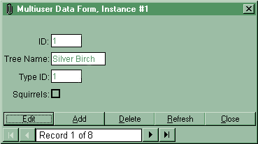



## ADO Multiuser Form

### Description

This VB6 project demonstrates how to edit an ADO multiuser recordset using databound controls.

It is based on the 'single-record form' created by the VB wizard, but adds:

* Enhanced error handling

* Improved user interface

The demo allows several instances of the form to be opened, for a 'pretend' multiuser

network.
 
### More Info
 
To use the form in your own project:

1: Add a copy of the form to your project

2: Set the ADO connection string in the form_load code to match your database

3: Place databound controls on the form (if you drop controls onto the form from the

data environment, set their datasource and datamember properties to blank)

4: You may need to adjust your Project/References if you are using a different version of ADO to v2.5, or Data Binding Collection older than SP4

             |
---                |---
**Submitted On**   |2000-10-09 20:15:00
**By**             |[John Andrews](https://github.com/Planet-Source-Code/PSCIndex/blob/master/ByAuthor/john-andrews.md)
**Level**          |Beginner
**User Rating**    |4.4 (31 globes from 7 users)
**Compatibility**  |VB 6\.0
**Category**       |[Databases/ Data Access/ DAO/ ADO](https://github.com/Planet-Source-Code/PSCIndex/blob/master/ByCategory/databases-data-access-dao-ado__1-6.md)
**World**          |[Visual Basic](https://github.com/Planet-Source-Code/PSCIndex/blob/master/ByWorld/visual-basic.md)
**Archive File**   |[CODE\_UPLOAD1071810172000\.zip](https://github.com/Planet-Source-Code/john-andrews-ado-multiuser-form__1-12105/archive/master.zip)

